# RepoRadar architecture: Next.js for SPA developers

This guide explains everything built in milestones M0 to M5, written for someone who
knows single-page apps (React + a router + `useEffect` fetching) but is new to the
Next.js App Router. Each section starts with the SPA habit, then shows what Next.js
does instead, and where to see it in this repo.

> Diagrams use Mermaid. They render on GitHub and in VS Code's Markdown preview.

## Contents

1. [The big shift](#1-the-big-shift)
2. [Folders are routes](#2-folders-are-routes)
3. [What happens on a request](#3-what-happens-on-a-request)
4. [Server Components and Client Components](#4-server-components-and-client-components)
5. [Fetching data without useEffect](#5-fetching-data-without-useeffect)
6. [Caching, static pages and ISR](#6-caching-static-pages-and-isr)
7. [Streaming with Suspense](#7-streaming-with-suspense)
8. [Errors, 404s and loading states](#8-errors-404s-and-loading-states)
9. [Route Handlers: the backend inside the app](#9-route-handlers-the-backend-inside-the-app)
10. [TanStack Query on top of Server Components](#10-tanstack-query-on-top-of-server-components)
11. [Navigation: soft, hard, and preserved pages](#11-navigation-soft-hard-and-preserved-pages)
12. [Parallel and intercepting routes: the preview modal](#12-parallel-and-intercepting-routes-the-preview-modal)
13. [Server Actions and optimistic updates: the watchlist](#13-server-actions-and-optimistic-updates-the-watchlist)
14. [Metadata](#14-metadata)
15. [Reading the build output](#15-reading-the-build-output)
16. [Cheat sheet: SPA habit → Next.js equivalent](#16-cheat-sheet-spa-habit--nextjs-equivalent)

---

## 1. The big shift

In an SPA the server sends an empty `index.html` and a JavaScript bundle. The browser
runs React, which fetches data from an API with `useEffect` and renders everything.

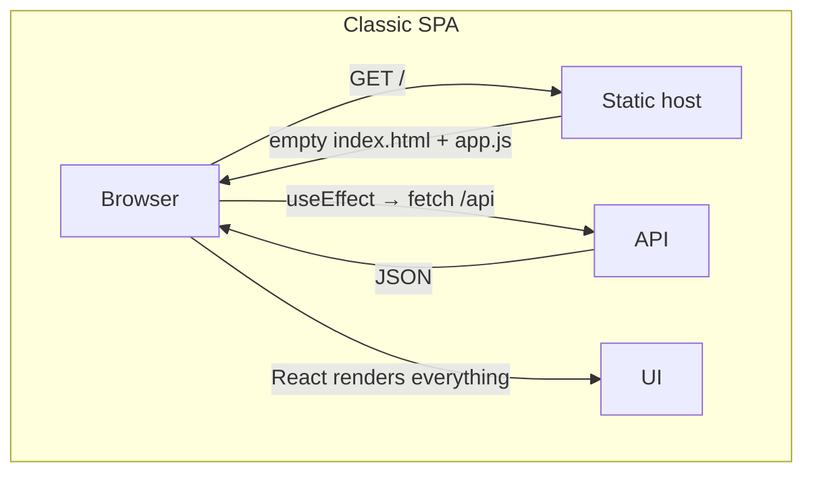

In Next.js, **React runs on the server first**. Components fetch their own data on the
server, and the browser receives finished HTML. Only the interactive parts ship
JavaScript and become live React in the browser.

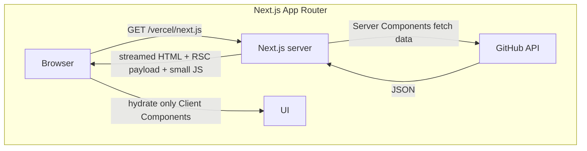

Three consequences you will see everywhere in this codebase:

- **Components are async and can `await` data directly.** No loading state boilerplate,
  no `useEffect`.
- **Secrets stay on the server.** `GITHUB_TOKEN` is read in `src/lib/github/client.ts`
  and never reaches the browser.
- **Less JavaScript.** The README renderer, language bar, stats and cards are plain
  HTML. They ship zero component JS.

---

## 2. Folders are routes

There is no `<Routes>` config. The folder structure under `src/app` *is* the router.
A folder becomes a URL segment, and a `page.tsx` inside it makes that URL reachable.

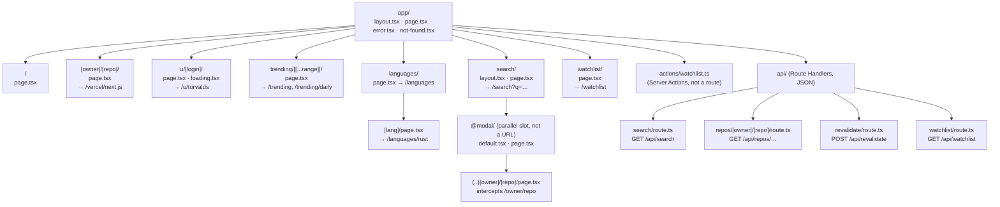

Folder naming conventions used here:

| Folder | Meaning | Example in repo |
| --- | --- | --- |
| `name/` | Static segment | `trending/`, `languages/`, `search/` |
| `[param]/` | Dynamic segment, value arrives in `params` | `[owner]/[repo]/`, `u/[login]/` |
| `[[...param]]/` | Optional catch-all: zero or more segments | `trending/[[...range]]/` matches `/trending` and `/trending/weekly` |
| `@slot/` | Parallel route slot. Not part of the URL; passed to the layout as a prop | `search/@modal/` |
| `(..)name/` | Intercepting route: "catch navigations to `../name`" | `@modal/(..)[owner]/[repo]/` |

Static segments win over dynamic ones, so `/u/torvalds` goes to `u/[login]`, not to
`[owner]/[repo]` with owner `u`.

Special files inside a route folder:

| File | Role |
| --- | --- |
| `page.tsx` | The UI for that URL. Without it the folder is not routable |
| `layout.tsx` | Wraps the page and all child routes. Stays mounted across navigations |
| `loading.tsx` | Automatic `<Suspense>` fallback for the segment |
| `error.tsx` | Error boundary for the segment (must be a Client Component) |
| `not-found.tsx` | UI for `notFound()` |
| `default.tsx` | Fallback for a parallel slot when Next can't tell what it should show |
| `route.ts` | An HTTP endpoint (GET, POST…) instead of a page |

Layouts nest. Every page here is rendered inside the root layout:

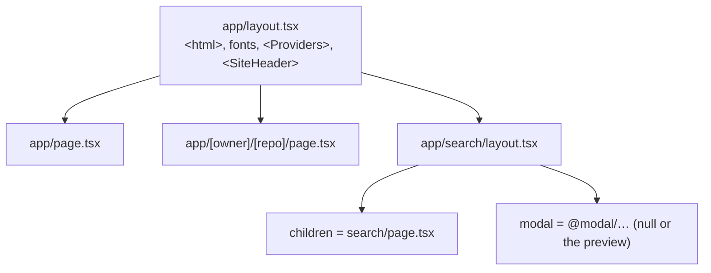

---

## 3. What happens on a request

Here is a first visit to `/TanStack/query`, a repo that was **not** prerendered at build
time.

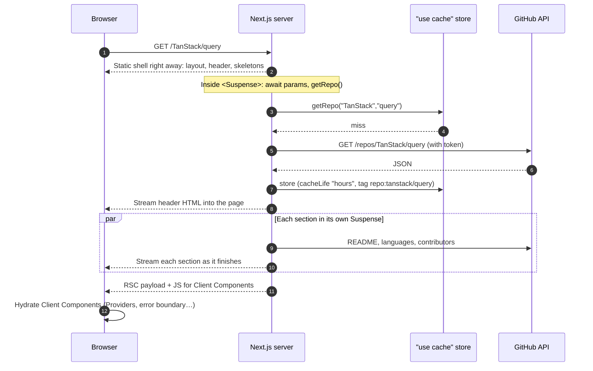

On the next visit the cache answers instead of GitHub, and Next stores the finished
page, so it is served like a static file.

What is the **RSC payload**? Besides HTML, the server sends a compact description of
the Server Component tree. The browser uses it to hydrate and, on later client-side
navigations, to update the page without full HTML.

---

## 4. Server Components and Client Components

Every component in `app/` is a **Server Component** by default. It runs only on the
server (at build time or per request), can be `async`, can read secrets, and ships no
JS. You cannot use `useState`, `useEffect`, event handlers or browser APIs in it.

A file starting with `"use client"` is a **Client Component**. It is rendered to HTML on
the server too, then hydrated in the browser so hooks and events work. It behaves like
the React you know.

The rule of thumb used here: **keep data fetching and layout on the server, push
interactivity to small client leaves.**

| Server Components (no JS shipped) | Client Components (`"use client"`) |
| --- | --- |
| `app/layout.tsx`, every `page.tsx` | `app/providers.tsx` (QueryClientProvider) |
| `[owner]/[repo]/readme.tsx`, `languages.tsx`, `contributors.tsx` | `app/error.tsx` (error boundaries must be client) |
| `components/repo-card.tsx`, `stat.tsx`, `site-header.tsx`, `updated-at.tsx` | `search/search-view.tsx` (input, infinite scroll) |
| `search/page.tsx` (prefetches data) | `search/search-result-card.tsx` (hover prefetch) |
| `@modal/(..)[owner]/[repo]/page.tsx` | `components/modal.tsx` (`<dialog>`, router.back) |
| `watchlist/page.tsx` (reads the cookie) | `@modal/…/repo-preview.tsx` (useQuery) |
| | `components/watch-button.tsx` (useMutation) |
| | `components/watchlist-nav-link.tsx` (header count) |
| | `watchlist/watchlist-items.tsx` (useOptimistic + form action) |

Server Components can render Client Components and pass them props (which must be
serializable) or even other Server Components as `children`. That is how the root
layout puts the server-rendered `<SiteHeader>` inside the client `<Providers>`:

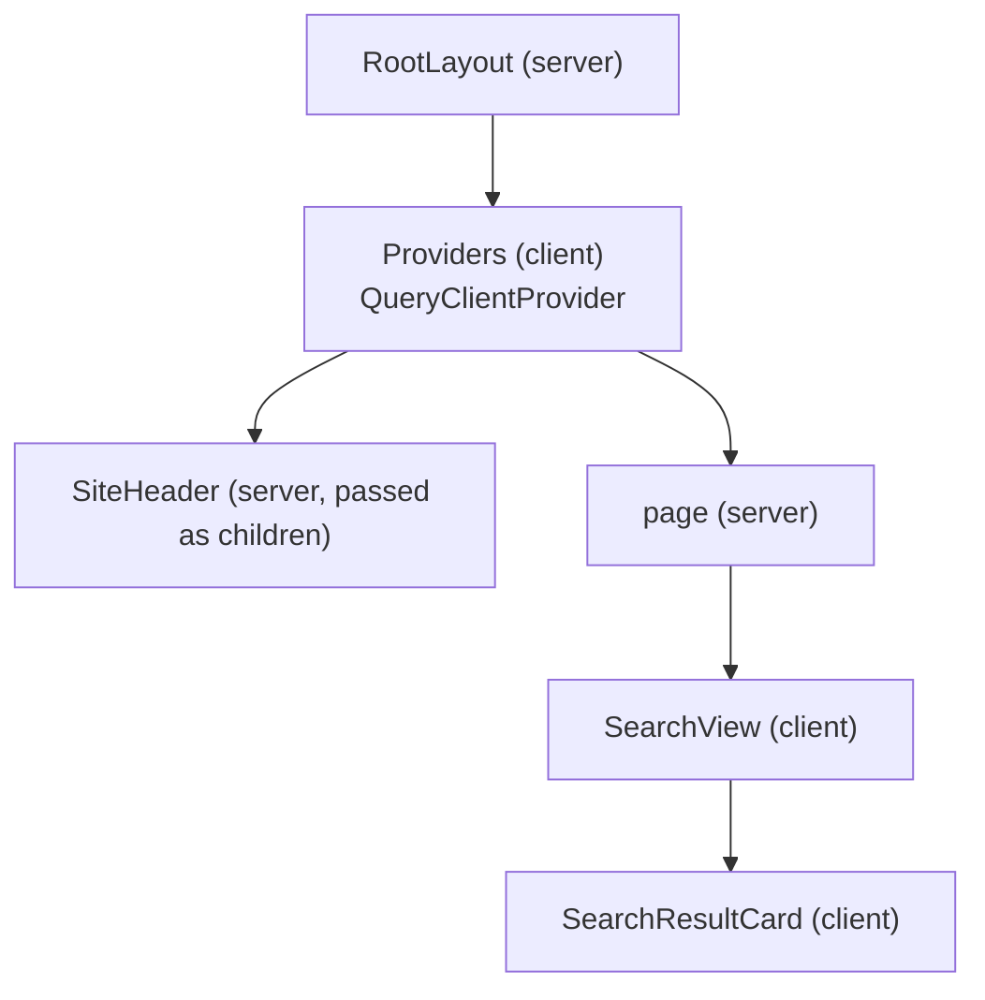

`import "server-only"` at the top of `src/lib/github/client.ts` turns an accidental
import from a Client Component into a build error, so the token can't leak.

---

## 5. Fetching data without useEffect

SPA:

```tsx
const [repo, setRepo] = useState(null);
useEffect(() => { fetch(`/api/repos/${id}`).then(r => r.json()).then(setRepo) }, [id]);
if (!repo) return <Spinner />;
```

Next.js Server Component (`src/app/[owner]/[repo]/page.tsx`):

```tsx
async function RepoView({ params }) {
  const { owner, repo } = await params;
  const data = await getRepo(owner, repo); // runs on the server, talks to GitHub
  if (!data) notFound();
  return <h1>{data.full_name}</h1>;
}
```

Notes:

- `params` and `searchParams` are **Promises** in Next 16. You `await` them.
- Independent requests run in parallel with `Promise.all`. See `src/app/u/[login]/page.tsx`,
  which fetches the user and their repos together instead of one after another.
- The loading state comes from `<Suspense fallback>` or `loading.tsx` (section 7), not
  from a `useState` flag.

The data layer lives in `src/lib/github/`:

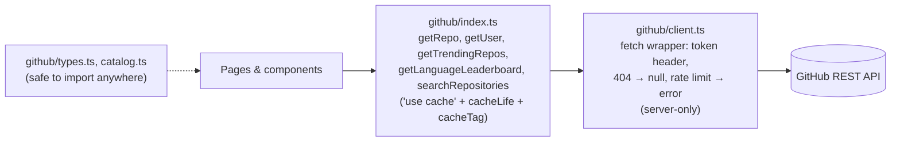

---

## 6. Caching, static pages and ISR

This project uses **Cache Components** (`cacheComponents: true` in `next.config.ts`), the
default for new Next 16 apps. The rule is simple: **nothing is cached unless you say so.**

### `"use cache"`

Put `"use cache"` at the top of an async function and its return value is cached. The
arguments become the cache key.

```ts
export async function getRepo(owner: string, repo: string) {
  "use cache";
  cacheLife("hours");                  // how long the result stays fresh
  cacheTag(tags.repo(owner, repo));     // a label for targeted invalidation
  return githubJson(`/repos/${owner}/${repo}`);
}
```

| Function | `cacheLife` | Tags |
| --- | --- | --- |
| `getRepo`, `getRepoReadmeHtml` | hours | `repo:<owner>/<name>` |
| `getRepoLanguages`, `getRepoContributors` | days | `repo:<owner>/<name>` |
| `getUser`, `getUserRepos` | hours | `user:<login>` |
| `getTrendingRepos(range)` | hours | `trending`, `trending:<range>` |
| `getLanguageLeaderboard(lang)` | days | `leaderboard`, `leaderboard:<lang>` |
| `searchRepositories` | minutes | none |

### Prerendering and ISR

At `pnpm build`, Next renders every page it can **ahead of time**. A page is fully static
when all of its data is cached and it doesn't read per-request data (cookies, headers,
search params).

`generateStaticParams` lists which dynamic URLs to build ahead of time:

- `[owner]/[repo]` builds `vercel/next.js` and `facebook/react`.
- `u/[login]` builds `vercel`.
- `trending/[[...range]]` builds `/trending`, `/daily`, `/weekly`, `/monthly`.
- `languages/[lang]` builds all 12 languages.

Any other URL is rendered on its first visit and then stored, so later visitors get it
instantly. When the `cacheLife` window passes, the next visitor still gets the stored
page while Next rebuilds it in the background. That whole behavior is **ISR**
(Incremental Static Regeneration).

### On-demand revalidation

`POST /api/revalidate` (`src/app/api/revalidate/route.ts`) calls
`revalidateTag(tag, "max")`. That marks every cached result with that tag as stale. The
next visit serves the old page and triggers a rebuild; the visit after gets the new one.

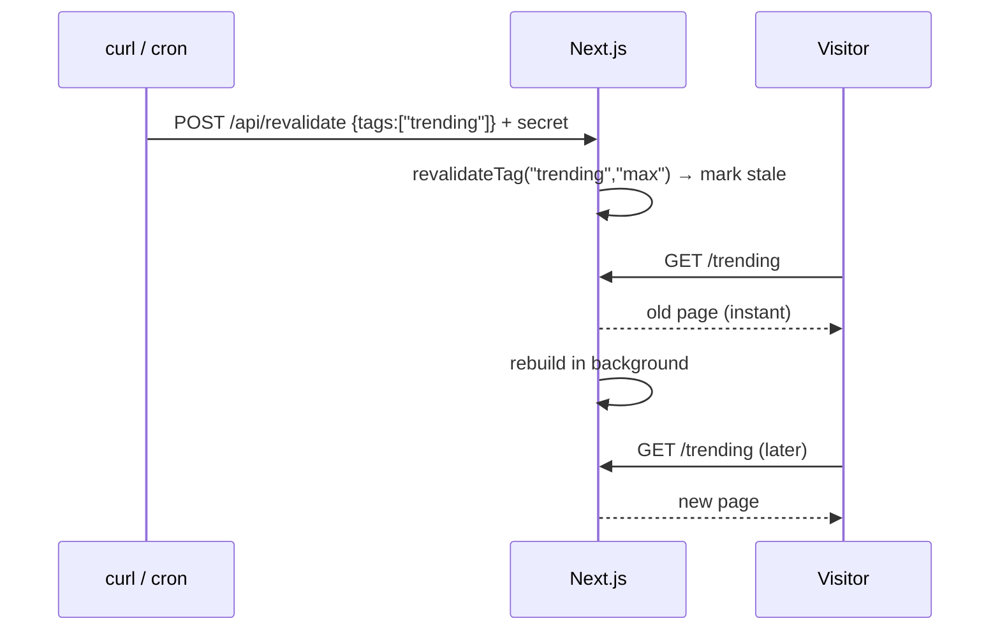

The "Generated … UTC" line on Trending and leaderboard pages shows when the cached data
was produced, so you can watch this happen with `pnpm build && pnpm start`. (In
`pnpm dev` caching is not representative.)

---

## 7. Streaming with Suspense

In an SPA, the page waits for all data or shows spinners managed by state. Here the
server sends HTML **in pieces**: everything outside a `<Suspense>` boundary goes out at
once, and each boundary's content streams in when its data is ready.

The repo page uses this deliberately:

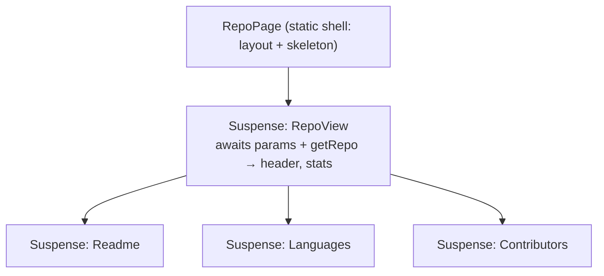

A slow README never blocks the stats or the sidebar. Each skeleton is replaced
independently.

Two ways to declare a boundary, both used here:

- **Inline `<Suspense>`**: `[owner]/[repo]/page.tsx`, `trending`, `languages/[lang]`,
  `search/page.tsx`. Fine-grained.
- **`loading.tsx`**: `u/[login]/loading.tsx`. Next wraps the whole page in a
  `<Suspense>` using this file as the fallback.

Why pages pass `params` *down* unawaited: with Cache Components, the part of a page that
doesn't depend on the URL can be prerendered once as an **App Shell** and reused for
every URL. Awaiting `params` inside the boundary keeps the shell generic.

---

## 8. Errors, 404s and loading states

| Situation | What handles it | File |
| --- | --- | --- |
| Repo or user doesn't exist | GitHub returns 404 → our client returns `null` → page calls `notFound()` | `app/not-found.tsx` |
| GitHub rate limit or outage | `GitHubRateLimitError` / `GitHubError` thrown → nearest `error.tsx` | `app/error.tsx` (has a "Try again" button that calls `retry()`) |
| Unknown trending range or language | page calls `notFound()` | `app/not-found.tsx` |
| Data still loading | Suspense fallback / `loading.tsx` | skeleton components |

Because the page is already streaming when a missing repo is discovered, the HTTP
status stays 200. Next adds `<meta name="robots" content="noindex">` so search engines
skip it.

---

## 9. Route Handlers: the backend inside the app

`route.ts` files are HTTP endpoints, like a small Express server living next to the
pages. This app has three:

| Endpoint | Used by | Why it exists |
| --- | --- | --- |
| `GET /api/search` | `SearchView` infinite scroll | Browser code can't hold the GitHub token, so it asks our server |
| `GET /api/repos/[owner]/[repo]` | hover prefetch, preview modal | Same reason |
| `POST /api/revalidate` | you, cron jobs, webhooks | Clears cache by tag; protected by `REVALIDATE_SECRET` |
| `GET /api/watchlist` | `WatchButton`, header count | The watchlist cookie is `httpOnly`, so browser JS can't read it directly |

For *writes* from the browser this app uses Server Actions instead of Route Handlers
(section 13).

Server Components don't need these endpoints. They call `src/lib/github` directly.
Route Handlers are only for code running in the browser or for outside callers.

---

## 10. TanStack Query on top of Server Components

If Server Components fetch data, why TanStack Query? Because some data needs to change
**after** the page loads without a server round trip: typing in search, loading the
next page on scroll, and the preview modal.

### One QueryClient per request on the server, one in the browser

`src/lib/get-query-client.ts`:

- On the server, every request gets a fresh `QueryClient`, so one user's data never
  leaks into another's.
- In the browser, a single client is reused for the session.
- `staleTime: 60s` stops the browser from refetching data the server just sent.

### Server prefetch → dehydrate → hydrate

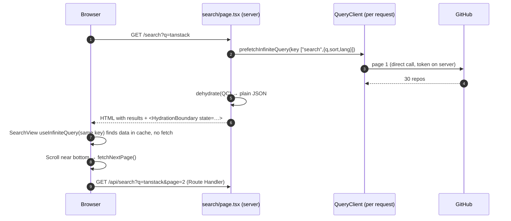

The key that makes this work is `src/lib/queries/`: the **same query key and options**
are imported by the server page and the client component. The server overrides only
`queryFn` so it can call GitHub directly instead of its own API.

### URL as state, without server round trips

`SearchView` writes `q`, `sort` and `lang` into the URL with `window.history.replaceState`.
Next keeps `useSearchParams()` in sync, so the component re-renders with new params,
TanStack Query sees a new key and fetches. `keepPreviousData` keeps the old results on
screen (dimmed) while the new ones load. Sharing or refreshing the URL reproduces the
same search, and that path goes through the server prefetch again.

### Prefetch on hover and placeholder data

- `SearchResultCard` calls `queryClient.prefetchQuery(repoQueryOptions(...))` on hover
  and focus. The data lands in the cache before the click.
- `RepoPreview` (the modal) reads the same key with `useQuery`, so it opens instantly.
  If you clicked without hovering, `placeholderData` pulls the repo out of the cached
  search results until the full record arrives.

---

## 11. Navigation: soft, hard, and preserved pages

- **`<Link>`** performs a **soft navigation**: no full reload. Next fetches the RSC payload
  for the new route and swaps only what changed. Layouts (header, providers) stay mounted
  and keep their state.
- Links are **prefetched** when they scroll into view, so most clicks feel instant.
- **`next/form`** (home page search box) is a `<form>` that does a soft navigation to
  `/search?q=…` instead of a full page submit.
- A plain `<a>` or a refresh is a **hard navigation**: the server renders the page from
  scratch. The preview modal's "Open full page" uses `<a>` on purpose, so the route isn't
  intercepted again.
- **Pages you leave are kept, not destroyed.** With Cache Components, Next hides the
  previous route with React `<Activity>` (it's `display: none`, state intact). Pressing
  Back restores it exactly: scroll position, input text, results. Up to 3 routes are kept.
  This is why `components/modal.tsx` opens the `<dialog>` in a layout effect and closes it
  in the cleanup: hiding a route runs cleanup, showing it again runs the effect.

---

## 12. Parallel and intercepting routes: the preview modal

Goal: clicking a search result shows the repo in a modal **with its own URL**, but
opening that URL directly shows the full page.

Pieces:

- `search/layout.tsx` receives two props: `children` (the search page) and `modal` (the
  `@modal` slot). It renders both.
- `@modal/(..)[owner]/[repo]/page.tsx` **intercepts** navigations to `/owner/repo` that
  start inside `/search`. `(..)` means "one segment up from `/search`", i.e. the root
  `[owner]/[repo]` route.
- `@modal/page.tsx` matches `/search` itself and renders nothing, so going back closes
  the modal.
- `@modal/default.tsx` renders nothing when Next can't recover the slot's state (fresh
  page loads).

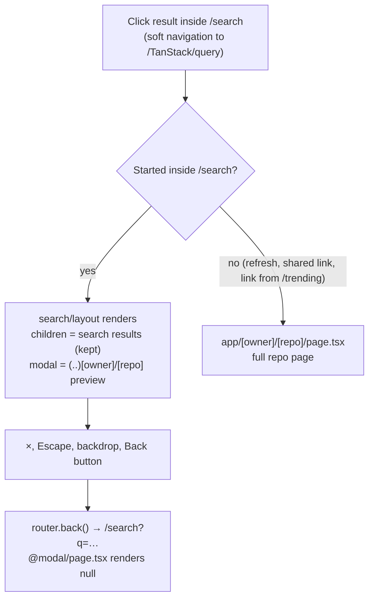

Because the URL is `/TanStack/query` while the modal is open, `useSearchParams()` returns
nothing. `SearchView` remembers the last `/search` params so the results underneath stay.

---

## 13. Server Actions and optimistic updates: the watchlist

### The SPA way vs Server Actions

In an SPA, saving something means writing a `POST /api/...` endpoint and calling it with
`fetch`. A **Server Action** skips the endpoint: you write an `async` function in a file
that starts with `"use server"`, import it into a Client Component and call it like any
function. Next turns each one into a POST endpoint behind the scenes and handles the
serialization.

`src/app/actions/watchlist.ts`:

```ts
"use server";

export async function setWatched(fullName: string, watched: boolean) {
  const list = await readWatchlist();      // reads the cookie
  // …validate, add or remove…
  await writeWatchlist(next);             // sets the cookie
  return { ok: true, list: next };
}
```

Things to know:

- **It's a public endpoint.** Anyone can call it with any arguments, so it validates
  `fullName` against a pattern and caps the list at 50 entries.
- **Return errors, don't throw them.** In production Next hides thrown error messages.
  The action returns `{ ok: false, error }` so the "watchlist is full" message reaches
  the user.
- **Cookies can only be written here** (or in Route Handlers). A Server Component can read
  them but not set them, because by the time it renders, the response is already streaming.

### Where the data lives

The watchlist is a JSON array of `"owner/repo"` names in an `httpOnly` cookie
(`src/lib/watchlist.ts`). No database or login needed, and every request carries it, so
Server Components can read it with `cookies()`. Reading `cookies()` makes that part of
the page per-request, so it must be inside `<Suspense>`.

### Two optimistic patterns, side by side

Optimistic UI means updating the screen before the server confirms, and undoing it if
the server fails. The app shows both ways to do it.

**1. TanStack Query mutation** (`components/watch-button.tsx`, used on the repo page,
search cards and the preview modal):

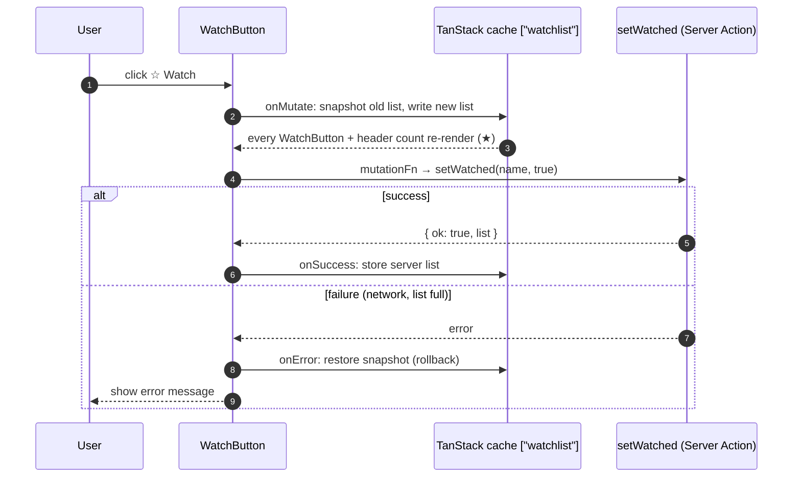

All watch buttons and the header counter read the same cache key, so a click anywhere
updates all of them at once.

**2. React `useOptimistic` with a form** (`watchlist/watchlist-items.tsx`, the Remove
buttons on `/watchlist`):

```mermaid
sequenceDiagram
  autonumber
  participant U as User
  participant WI as WatchlistItems
  participant SA as removeFromWatchlist (Server Action)
  participant P as /watchlist (Server Component)
  U->>WI: submit <form action={remove}>
  WI->>WI: removeOptimistic(name): row disappears now
  WI->>SA: removeFromWatchlist(formData)
  SA->>SA: write cookie
  SA-->>P: Next re-renders the page in the same response
  P-->>WI: new `repos` prop
  WI->>WI: optimistic state settles on the new props
  Note over WI: If the action fails, the transition ends with the old props and the row comes back by itself
```

Rule of thumb: `useOptimistic` fits when the truth comes from server-rendered props;
TanStack's `onMutate` fits when the truth lives in the client cache.

### Keeping server-rendered and cached data in sync

`/watchlist` is rendered on the server, but buttons elsewhere change the list through the
client cache. Because Next keeps visited pages alive (section 11), going Back to
`/watchlist` could show an old list. `WatchlistItems` compares the names the server
rendered with the cached list and calls `router.refresh()` when they differ, which asks
the server for a fresh render of the current page.

`/watchlist` also seeds the client cache (`setQueryData` + `HydrationBoundary`), so the
header count doesn't need its own request on that page.

### A hydration trap and the fix

The watch button is disabled until the watchlist has loaded. Sometimes the list was
already in the cache by the time a button hydrated (another component had fetched it).
The first client render then said "enabled" while the server HTML said "disabled".
React doesn't fix mismatched attributes during hydration, so the button stayed disabled
forever.

The fix is `src/hooks/use-hydrated.ts`: it returns `false` during SSR and the hydration
render, `true` afterwards. Components that depend on browser-only data render the server
version first, then update. Use the same trick for anything based on `localStorage`,
the current time, or other data the server can't know.

---

## 14. Metadata

Instead of managing `<title>` with a library, pages export metadata:

- `app/layout.tsx` exports a static `metadata` object with a title template
  (`%s · RepoRadar`).
- Dynamic pages export `generateMetadata({ params })`, which fetches the same cached data
  as the page (no extra GitHub call, thanks to `"use cache"`) and returns title,
  description and Open Graph tags. Examples: repo, user, trending, leaderboard and search
  pages.

---

## 15. Reading the build output

`pnpm build` prints a symbol per route:

| Symbol | Meaning | Examples |
| --- | --- | --- |
| `○` Static | Fully built ahead of time, served as a file | `/`, `/languages`, `/trending/daily`, `/vercel/next.js` |
| `◐` Partial Prerender | Static shell built ahead of time, the rest streams per request | `/[owner]/[repo]` for unknown repos, `/search`, `/watchlist` |
| `ƒ` Dynamic | Runs on every request | `/api/search`, `/api/revalidate` |

`/search` is `◐` because results depend on `?q=`, and `/watchlist` because it reads a
cookie. Both call `await connection()` before using TanStack's `dehydrate()`, which
explicitly says "this part only runs at request time".

---

## 16. Cheat sheet: SPA habit → Next.js equivalent

| SPA habit | In this project |
| --- | --- |
| `react-router` route config | Folders in `src/app` |
| `useEffect` + `fetch` + loading state | `async` Server Component + `<Suspense>` |
| API keys in `.env` exposed to the bundle | `process.env.GITHUB_TOKEN` read only on the server (`server-only`) |
| Global spinner | `loading.tsx` or a `<Suspense fallback>` per section |
| `<ErrorBoundary>` | `error.tsx` |
| 404 route | `notFound()` + `not-found.tsx` |
| `react-helmet` | `metadata` / `generateMetadata` |
| Backend for the frontend | `route.ts` Route Handlers |
| HTTP caching / SWR on the client only | `"use cache"` + `cacheLife` + `cacheTag` on the server, TanStack Query on the client |
| Rebuild and redeploy to update static pages | ISR + `revalidateTag` |
| Modal state in `useState` | Parallel + intercepting routes, state in the URL |
| Page unmounts when you navigate away | Page is hidden with `<Activity>` and restored on Back |
| `POST /api/...` endpoint + `fetch` for mutations | Server Action (`"use server"`) called like a function or used as `<form action>` |
| localStorage for user prefs | Cookie set in a Server Action, readable by Server Components |
| Optimistic update by hand | TanStack `onMutate` + rollback, or React `useOptimistic` |
